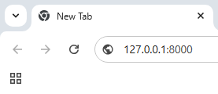
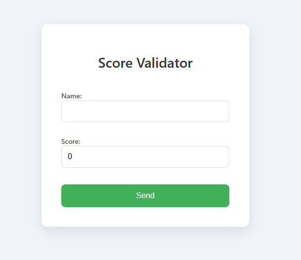
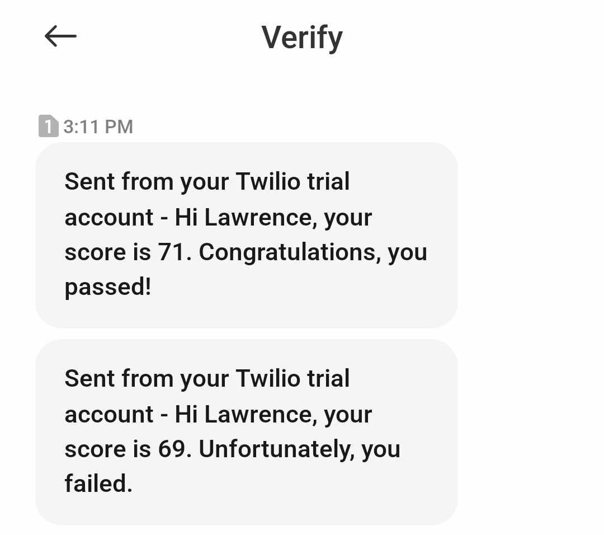

#  SMS Messaging Application

This Django application offers a simple yet powerful solution for sending SMS messages through integration with a third-party SMS gateway service. It is designed to be user-friendly, flexible, and easy to integrate into any existing Django project or web application. With this application, developers can quickly add SMS functionality to their projects, allowing for a seamless user experience. 🚀

## ✨ Features
- 📤 Send SMS messages to specified phone numbers.
- ⚙️ Configurable settings for SMS gateway integration.
- 🧪 Basic form interface for testing SMS functionality.

## 📋 Requirements
- 🐍Python 3
- 🌐Django 5 or higher
- 📡 A third-party SMS gateway account (e.g., Twilio, or other providers).

## 📚 Installation

1. Clone the repository:
   ```bash
   git clone https://github.com/jeluayan28/Django_SMS.git
   cd Django_SMS
   ```
2. Install the required Python packages:
   ```bash
   pip install -r requirements.txt
   ```

3. Set up the database:
   ```bash
   python manage.py makemigrations
   python manage.py migrate
   ```
4. Create super user account:
   ```bash
   python manage.py createsuperuser
   ```

5. Configure the SMS gateway credentials:
   - Open the `models.py` file in `dashboard` folder and add the necessary SMS gateway credentials:
     ```python
     account_sid = 'your_api_key_here'
     auth_token = 'your_api_secret_here'
     from_ = 'your_trial_number_here'
     to = 'your_receiver_number_here'
     ```

6. Run the server:
   ```bash
   python manage.py runserver
   ```

## 🚀 Usage

1. Access the application in your web browser at `http://127.0.0.1:8000/`.



2. Use the SMS form to input the recipient's name and the score to validate.



3. Click "Send" to deliver the SMS.


### Sample Output:





## 📋License
This project is licensed under the MIT License.
